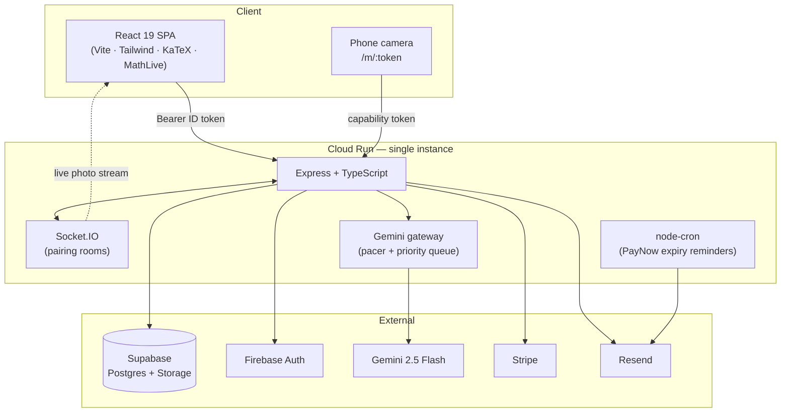

# Markr

**A LeetCode-style practice platform for Singapore H2 A-Level Mathematics — with an AI examiner that grades handwritten working.**

🔗 **Live:** https://math-trainer-a6zwhjpjtq-as.a.run.app

Students pick a topic from a pan-and-zoom syllabus map, attempt real prelim questions, and either type an answer or **photograph their handwritten working** and have it marked against the model solution — method marks, presentation, and all. Questions they get wrong come back on an SM-2 spaced-repetition schedule.

Built solo over three months: **232 commits, 66 merged PRs, ~503 questions live.**

---

## At a glance

| | |
|---|---|
| **Stack** | React 19 · Vite · TypeScript · Tailwind · KaTeX · Express · Supabase (Postgres) · Firebase Auth · Gemini · Stripe · Socket.IO |
| **Question bank** | 503 questions — 271 from 12 schools' 2025 prelim papers (Papers 1 & 2), 232 tutorial discussion questions |
| **Syllabus** | 26 topics, ~120 mapped prerequisite concepts |
| **Code** | ~6.1k lines backend · ~9.7k lines frontend · ~27k lines of SQL migrations (85 files) |
| **Tests** | 180 unit tests across 16 files (Vitest), green in CI |
| **Deploy** | Single container on Google Cloud Run (`asia-southeast1`), auto-deployed from `main` via Cloud Build |
| **Timeline** | 8 Jun 2026 → 9 Sep 2026 |

---

## Architecture

One container serves both the API and the built SPA, deliberately. Same-origin means relative `/api` fetches, the Socket.IO upgrade, and the QR code built from `window.location.origin` all work with zero CORS or tunnel configuration — which matters because the phone-upload flow needs a phone on a different network to reach a URL the desktop generated.



**`max-instances=1` is load-bearing**, not a cost saving: QR-pairing state, per-user cooldowns, and the Gemini rate-limit window all live in process memory. Horizontal scaling would require moving them to Redis first — a documented, deliberate trade rather than an oversight.

---

## Engineering highlights

The interesting problems here weren't the CRUD. These are the ones worth reading the code for.

### 1. Grading maths that students write ten different ways

`backend/src/services/answerChecker.ts`

`3/4`, `\frac34`, `\dfrac{3}{4}`, `0.75`, `\tfrac{6}{8}` are the same answer. So are `x<-2 or x>5` and `x>5 \text{ or } x<-2`. Naive string comparison fails almost every real submission.

The checker is a **five-stage pipeline where every stage can only add acceptance, never remove it** — so a change can loosen grading but can never start rejecting an answer that previously passed:

1. Normalised-string equality (LaTeX canonicalisation: compact fractions expanded, spacing commands stripped, `\dfrac`/`\tfrac`/`\cfrac` unified)
2. `mathjs` numeric evaluation — real or complex
3. Symbolic equivalence via two-point substitution for expressions with free variables
4. `±` answers compared as an unordered two-element set
5. Inequality chains and `or`/`and` clauses compared order-insensitively

Backed by the largest test file in the repo. A subtle one baked into the migration workflow: the `or` connective must use *regular* spaces — a LaTeX `\ ` normalises into a stray `\or`, which the parser reads as an unknown command and refuses to split on.

### 2. Never trust the JWT for authorisation state

`backend/src/middleware/auth.ts`

Firebase custom claims ride inside an ID token that lives up to an hour, and `setCustomUserClaims` **cannot invalidate tokens already issued**. Deriving the paid tier from the claim meant a cancelled subscriber kept premium quotas for up to an hour after cancelling.

The fix inverts the relationship: **the database row is enforcement, the claim is decoration.** `deriveTier()` resolves `paid` only from `subscription_status` plus a live `access_expires_at`, read on every request — free, because `requireAuth` already fetches that row to resolve the internal user id. Grant/revoke writes the row *before* touching Firebase, so an outage can delay the UI but can never leave a cancelled user with access or a paying user without it. The frontend paints optimistically from the claim to avoid a "Free" flash, then overwrites from `GET /api/me`.

A paid claim sitting over a row that was never billed is logged as a warning and resolved to `free` — that combination can only come from a hand-edited token.

### 3. Rate limiting that can't be weaponised by one user against another

`backend/src/middleware/rateLimit.ts`

`express-rate-limit` keys on IP by default. Two students behind the same school NAT therefore shared a bucket — one of them doing homework could lock out the entire cohort.

Limiters are now **account-keyed**, falling back to the pairing's owner on the token-authed phone routes and only then to IP. One deliberate exception: the feedback route stays IP-keyed and runs *before* `requireAuth`, so hammering it never reaches Firebase token verification — it has no account to key on by design.

A sharp edge worth knowing: express-rate-limit **greps the key generator's source text** for `req.ip` and rejects it unless `ipKeyGenerator` is called inline in that same function (a raw IPv6 address lets a client rotate a /64 for a fresh bucket per request). Extracting it into a helper silently fails the check.

### 4. Webhook idempotency where replays cost real money

`backend/src/services/billingService.ts` · migration `030_stripe_events.sql`

Stripe delivers at-least-once. The PayNow grant is **additive** — it reads `access_expires_at` and adds a period on top — so a single replayed event hands out a second month for one payment.

`claimEvent()` inserts the event id **before any side effect**, using the primary key as an atomic lock. Crucially it's a *two-state* claim, not a "seen" marker: `processing` is written up front and promoted to `completed` only after the handler fully succeeds. A process that dies mid-handler leaves the event re-claimable once a 5-minute lease expires, instead of being permanently marked handled with the payment silently dropped.

Route-level status codes are chosen for Stripe's retry semantics: a bad signature returns 400 (not from Stripe — nothing to retry), everything else returns 500 so the retry re-runs the work.

Every write routes through `updateUserOrThrow()`, because supabase-js returns errors on the result object rather than throwing — an unchecked write would leave a `paid` claim with no matching row *and still return 2xx*, so no retry would ever correct it.

### 5. Five layers of AI cost control

A student with a photo grader and an LLM tutor can burn an API budget in an afternoon. Spend is bounded at five independent levels:

| Layer | Mechanism |
|---|---|
| Burst | `express-rate-limit`, account-keyed, per route |
| Daily usage | Tier quota counted in SGT calendar days (free: 3 scans + 3 hints/day) |
| Per-user pacing | Cooldowns between *accepted* requests (5s chat, 60s grade) |
| Outbound | Shared Gemini gateway — sliding-window RPM pacer + priority queue + daily budget |
| Backstop | Global IP-keyed limiter over the whole `/api` surface |

The gateway (`services/geminiGateway.ts`) is the interesting one: a single choke point for every Gemini call that **paces proactively under the key's real limit** so users queue rather than seeing Google's 429s, fails fast once the daily budget is spent (queueing cannot manufacture daily capacity), retries transient 5xx from the queue with backoff, and prioritises interactive chat over background diagnosis. A failed AI call clears the user's cooldown stamp, so an outage doesn't cost them their turn.

### 6. A graph compiler for a subject that's half diagrams

`backend/src/services/graphService.ts`

Sketch questions can't be graded as text, and the source PDFs' diagrams aren't reusable. So graphs are authored as **JSONB specs** and compiled server-side into render-ready polylines.

The compiler samples expressions with `mathjs`, insets sampling near declared vertical asymptotes so curves approach them instead of shooting to ±∞ on the boundary sample, **snaps labelled points onto their curve analytically** (and onto parametric polylines by nearest vertex), and injects labelled x-values into the sample grid so a stationary-point dot sits exactly on the drawn line rather than floating beside it.

The same format powers two different things: hidden `solution_graph` sketches, and `prompt_graph` diagrams *given* in the question — the latter attached to the public payload, where a malformed spec degrades to `null` rather than crashing the question.

The corner I'm most pleased with: the engine is 2-D only, but two exam questions need 3-D scenes. Those are drawn as the exam's own **oblique projection, with the basis vectors measured off the original PDF figures**, so the reproduction matches the paper a student is holding.

### 7. Scoping an exemption so it isn't a bypass

Gemini transcribes handwriting into editable LaTeX so a student can correct a misread character and re-grade without the 60-second cooldown.

Exempting *every* typed re-grade turned that route into a standalone, uncooled grader accepting arbitrary LaTeX. The exemption is now scoped to what it was actually for: the newest grading for that question must be a *photo* grading under 10 minutes old. It's spent by the **attempt**, not by a successful grade — otherwise a rejected correction writes no row, leaves no cooldown, and lets junk be resubmitted at the rate limiter's pace for the whole grace window.

---

## Tech stack

**Frontend** — React 19, Vite, TypeScript (strict), Tailwind, React Router 7, KaTeX for rendering, **MathLive** for input (with a custom 10-group symbol palette, because typing `\frac{x}{5}` on a laptop is miserable), Socket.IO client, Firebase Auth SDK.

**Backend** — Express 4 + TypeScript (strict, no `any`, `NodeNext` resolution), Zod on every request body, Helmet, `firebase-admin` for token verification, `@google/genai`, Stripe, Resend, `node-cron`, Socket.IO, `mathjs`.

**Data** — Supabase Postgres (12 tables), private Storage bucket for solution photos. The backend is the only DB client via the service-role key; `anon`/`authenticated` grants were revoked and RLS enabled across the board.

**Conventions** — Routes stay thin; all logic in services; a route never touches `supabase` directly. Frontend types in `src/types/api.ts` mirror the backend's. `correct_answer` and `solution_latex` are stripped server-side and returned only after submission.

---

## Data model

```
topics ──< topic_concepts
   │
   └──< questions ──< attempts        (one row per graded part)
            │      ──< starred_questions
            │      ──< chat_messages   (threaded Socratic hints)
            │      ──< gradings        (one row per photo/text submission)
            └──< spaced_repetition_cards

users ──< study_plans, user_diagnoses
stripe_events                          (webhook idempotency ledger)
```

Questions support a `parts JSONB` column for real exam structure — a shared preamble plus `(a)`, `(b)(i)`, `(b)(ii)` sub-parts, each independently graded, with `answer_type: null` marking "show that" parts that take no input. Multi-value parts ("find *a*, *b* and *c*") render one labelled box per field and are correct only when every field matches. The solution unlocks only once every graded part is done.

---

## Running locally

```bash
npm run setup                  # installs backend + frontend
npm run dev                    # both servers concurrently
```

Or separately:

```bash
cd backend  && npm run dev     # :3001, tsx watch
cd frontend && npm run dev     # :5173, proxies /api/* → 3001
```

**Environment** — copy `backend/.env.example` to `backend/.env`. Minimum viable: `SUPABASE_URL`, `SUPABASE_SERVICE_ROLE_KEY`, plus the Firebase Admin trio (`FIREBASE_PROJECT_ID`, `FIREBASE_CLIENT_EMAIL`, `FIREBASE_PRIVATE_KEY`). Add `GEMINI_API_KEY` for hints and photo grading, `STRIPE_*` for billing, `RESEND_API_KEY` for transactional email. The frontend needs the four `VITE_FIREBASE_*` values.

**Database** — run every file in `backend/supabase/migrations/` in numeric order in the Supabase SQL editor.

**For the QR phone-upload flow**, open the desktop app on your machine's **LAN IP** (`http://192.168.x.x:5173`), not `localhost` — otherwise the QR encodes an address the phone can't reach.

---

## Testing & CI

```bash
cd backend && npm test         # 180 tests, 16 files (Vitest)
```

Tests concentrate where bugs are expensive and logic is pure: the answer checker, the Gemini gateway's pacing and queueing, webhook idempotency, quota accounting, Singapore-time day boundaries, rate-limit key generation, and email templates. No mocked-database integration theatre.

GitHub Actions runs on every push and PR — backend typecheck + build + test, frontend lint + typecheck + build — with the production bundle uploaded as an artifact on `main`. Merges to `main` trigger a Cloud Build deploy: Docker build → Artifact Registry → Cloud Run.

---

## Project structure

```
backend/
  src/
    routes/       thin HTTP layer, Zod validation
    services/     all business logic
    middleware/   auth, rate limiting
    config/       tier limits, AI limits, feature gates
    db/           lazy clients (Supabase, Firebase, Gemini, Stripe, Resend)
    jobs/         cron
  supabase/migrations/    85 files, schema + question data
frontend/
  src/
    pages/        landing, roadmap, practice, review, profile, history, starred
    components/   question, math, topic, chat, layout, pair, ui
    hooks/        one per data concern
    lib/          api client, firebase, socket, LaTeX rendering
```

---

## Status

**Built** — Firebase auth with free/paid tiers · Stripe card + PayNow billing (with stacking and card↔PayNow rollover) · usage quotas, cooldowns and a shared AI gateway · pan-and-zoom syllabus roadmap · multi-part practice sessions · MathLive keyboard · AI Socratic hint chat · photo-based AI grading with editable transcription · QR phone upload over Socket.IO · model solution graphs for every sketch question · spaced repetition, weak-topic diagnosis and AI study plans · streaks with a contribution heatmap · starred questions and history · transactional emails.

**Not built** — timed mock exam mode · admin question editor · a mistake-log page (the data is already captured on every grade).

---

<sub>Built by Chang Fa Zhi. The question bank is derived from publicly circulated 2025 prelim papers and school tutorial materials; tutorial questions have their school/year provenance deliberately stripped.</sub>
